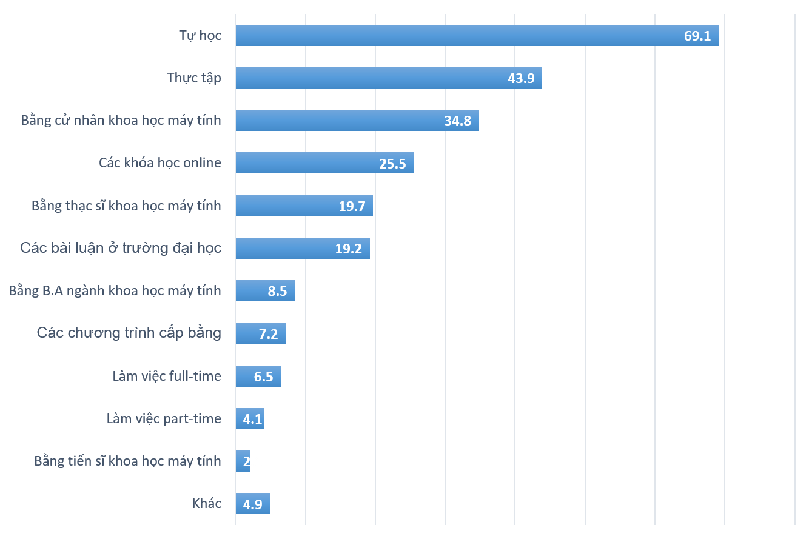

Theo khảo sát của Stackoverflow, có đến 56% lập trình viên không có bằng đại học về công nghệ thông tin hay các ngành liên quan và cách thông dụng nhất mà mỗi lập trình viên học lập trình đó chính là tự học (69% số người được hỏi nói rằng họ tự học một phần; 13% cho biết họ hoàn toàn tự học).

Khảo sát về bằng cấp của các lập trình viên trên Stack Overflow

Bên cạnh đó, trường dạy lập trình DevMoutain cũng chỉ ra số lượng sinh viên theo ngành Khoa học máy tính ở Mỹ cũng chỉ tăng khoảng 2.5% từ năm 1980 cho đến nay. Trong khi đó, theo Cục Thống kê Lao động Mỹ, việc làm của các nhà phát triển phần mềm được dự đoán sẽ tăng 24% trong khoảng thời gian từ 2016 đến 2026 và vượt gấp ba lần mức tăng trưởng việc làm trung bình dự kiến 7% trong tất cả các ngành nghề khác.

Bạn đã nhận thấy điều gì chưa? Mỗi ngày càng có nhiều công việc liên quan đến ngôn ngữ lập trình được sinh ra, vậy tại sao con số đó lại tỉ lệ nghịch với số sinh viên theo ngành công nghệ thông tin vậy? Điều này có thể là do nhiều người đã hiểu được rằng, không phải lập trình viên nào cũng cần bằng cấp về code mới có thể làm việc được.

## Các nhà tuyển dụng nghĩ gì?

Trong số 4.499 công việc hiện đang được liệt kê tại Stack Overflow Jobs (trên tất cả các khu vực), kết quả tìm kiếm cho thấy có 1.760 kết quả trùng với điều kiện "có bằng cấp" (“degree OR bachelor OR BS OR BA OR B.S. OR B.A.”). Vì vậy, chúng ta có thể suy ra rằng 2.739 (tương đương 61%) công việc không chỉ định mức độ bằng cấp có liên quan trong ngành CNTT.

Đúng vậy, sẽ có một số công ty yêu cầu bằng cấp nhưng không phải tất cả, và bạn có hơn 60% cơ hội để làm một lập trình viên. Tuy nhiên, bạn cần chứng minh những gì bạn đã làm và có thể làm để tạo nên lợi ích cho công ty. Theo Nick Larsen, bất kể bằng cấp của bạn trong ngành nào thì nếu bạn có thể chỉ ra bạn đã từng thành công trong một lĩnh vực liên quan, nó sẽ có lợi cho bạn. Đấy là lý do các cụm từ như "kinh nghiệm tương đương" được nhắc đến rất nhiều trong các bài tuyển dụng.

Đặc biệt là trong ngành công nghệ thông tin nơi mà kỹ năng thực hành được đánh giá rất cao thì bằng cấp không còn quá quan trọng. Có thể nói, với các công ty lập trình thì năng lực cao hơn bằng cấp. Khi bạn đi phỏng vấn, các nhà tuyển dụng sẽ đưa ra các bài test để kiểm tra kỹ năng tư duy code của bạn. Sau vài câu hỏi, một hai bài test ngắn, họ có thang điểm đánh giá rất chính xác về ứng viên mà họ cần. Đơn giản ngành IT nói chung, lập trình viên nói riêng, với những người phỏng vấn có kinh nghiệm, họ hoàn toàn biết ứng viên nào có năng lực tốt, họ không quan tâm quá nhiều đến tấm bằng của mình.

## Bằng cấp thôi là không đủ

Nói vậy không có nghĩa là tấm bằng của bạn cũng không có ý nghĩa gì hơn so với người khác. Nếu bạn đã có nền tảng ở đại học, hãy nâng cấp tấm bằng của mình hơn bằng các hoạt động khác liên quan đến ngành mà bạn theo đuổi. Vậy nên khi đi xin việc, đừng chỉ dựa vào tấm bằng đại học của mình mà hãy liệt kê những điều bạn đã học được và các kiến thức của bạn liên quan đến công ty. Ngành công nghiệp công nghệ phát triển rất nhanh và không ai quan tâm đến những gì bạn học được ở trường đại học năm năm trước hay thậm chí năm tháng trước, tất cả những gì họ quan tâm là những gì bạn có thể làm cho họ bây giờ.

## Tự học

Hầu hết những bạn chuyển ngành sang học lập trình đều chọn tự học. Sau đó mới đi học trung tâm hoặc thi vào trường cao đẳng nào đó. Tuy nhiên, các bạn lại mắc phải lỗi khá cơ bản đó là không vạch ra lộ trình cho mình. Hãy thử tưởng tượng, bạn đi du lịch nước ngoài mà không có bản đồ của nước đó thì bạn sẽ ra sao? Bạn có thể hỏi người bản địa để tìm địa điểm mình muốn đến, cũng được thôi. Nhưng nó sẽ mất thời gian và tiền bạc. Tốt nhất là bạn nên cầm trong tay tấm bản đồ và định hướng đường đi cho mình.

Một nhược điểm của việc không có lộ trình học nữa là bạn dễ bị hổng kiến thức căn bản. Các bạn thường có xu hướng học những gì làm được ngay như làm web app, mobile app,… Mà bỏ qua các môn căn bản như mạng máy tính, hệ điều hành, thuật toán.

## Tham gia các khóa đào tạo ngắn hạn

Khi đăng ký khóa học và chỉ sau một vài tháng nỗ lực, bạn đã có thể tìm việc. Nghiên cứu của coursereport.com cho thấy 60% những người đi học ở các trung tập dạy code đã có bằng cử nhân (hầu hết trong các lĩnh vực không phải là khoa học máy tính). Vì vậy họ coi đi học thêm ở các trung tâm là một nền giáo dục bổ sung, thay vì bằng đại học.Việc học này sẽ tiết kiệm chi phí hơn là học bốn năm tại một trường đại học và hiệu quả cũng sẽ cao hơn, khi mà bạn được dạy vào các kiến thức trọng tâm để nhanh chóng làm được việc.

Trên thực tế, 89% nhà tuyển dụng tin rằng sinh viên tốt nghiệp tại các trung tập dạy lập trình cấp tốc sẽ được trang bị kiến thức thậm chí là nhiều hơn những người có bằng đại học.

Nếu có nhu cầu tham gia các khóa học ngắn hạn bạn nên tìm hiều về các trung tâm đào tạo lập trình uy tín chất lượng và có đảm bảo đầu ra.

> Các bạn có thể tham khảo các khóa học [tại đây](https://techmaster.vn/)

## Vậy bạn có cần bằng cấp để trở thành lập trình viên không?

Bạn chỉ có thể trả lời câu hỏi này bằng cách các định mục tiêu cá nhân của bạn là gì. Bạn có muốn một nền giáo dục toàn diện và truyền thống? Vậy thì câu trả lời là có. Bạn có thể có được một công việc lập trình mà không cần bằng cấp? Có, bạn có thể. Nếu bạn quan tâm nhiều hơn đến việc bắt đầu sự nghiệp trong lĩnh vực công nghệ một cách nhanh chóng, thì bạn không nhất thiết phải có bằng cấp về CNTT, có nhiều giá trị bạn cần hơn một tấm bằng. Các nhà tuyển dụng sẽ chọn ai: một người có 3 năm kinh nghiệm làm việc và không có bằng cấp, hoặc một người có bằng cấp nhưng không có kinh nghiệm thực tiễn?

Sau khi đọc bài viết này, mình tin là bạn đã có câu trả lời cho bản thân mình.

Nguồn tham khảo: stackoverflow.blog và https://blog.devmountain.com/
